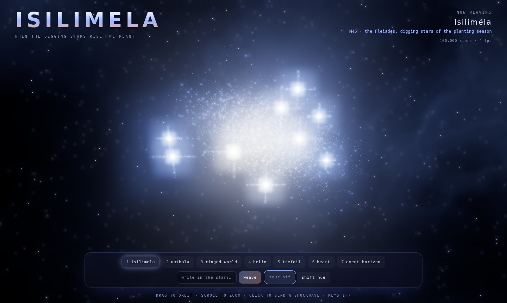
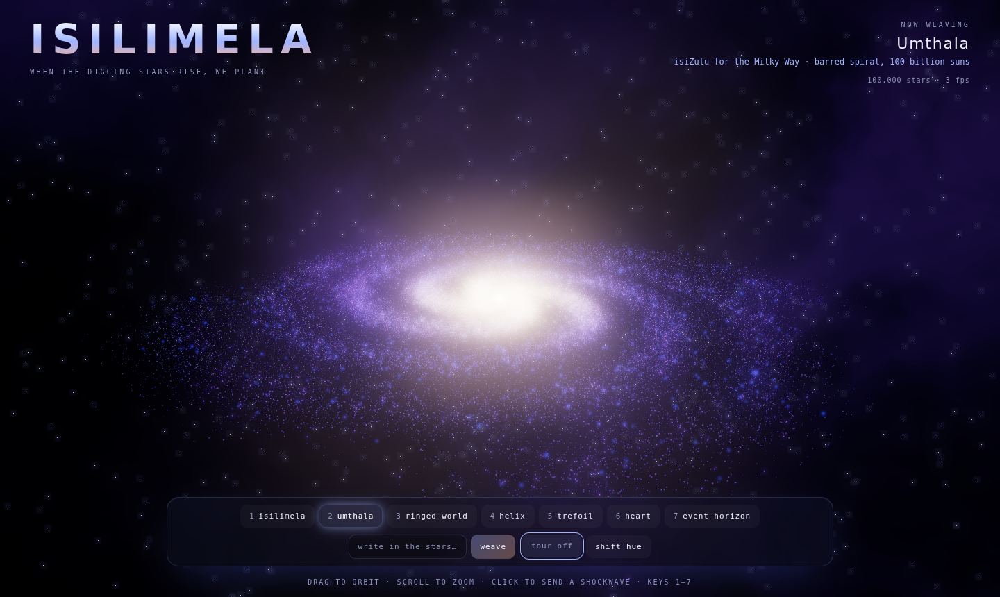
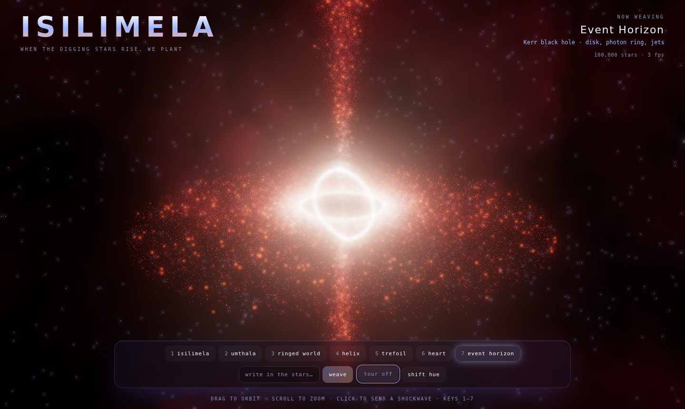
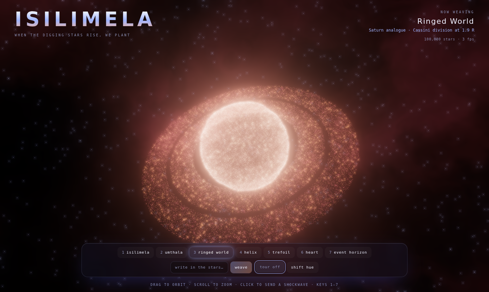
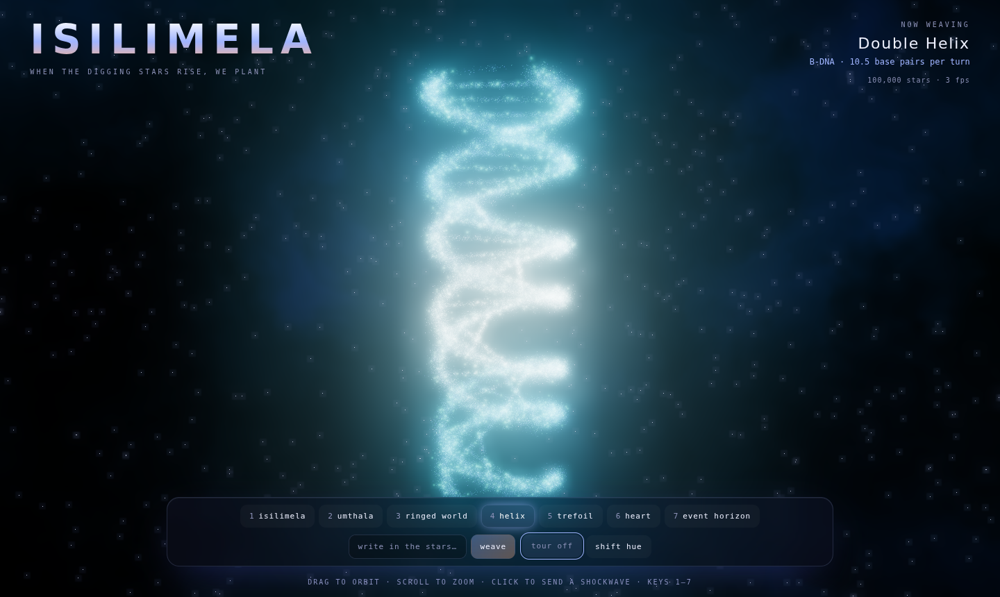
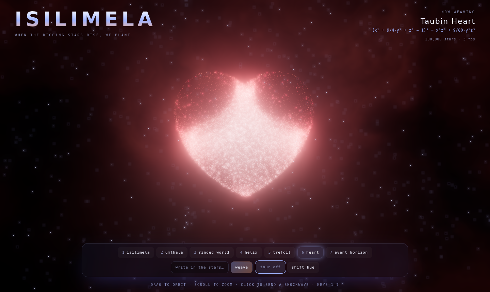
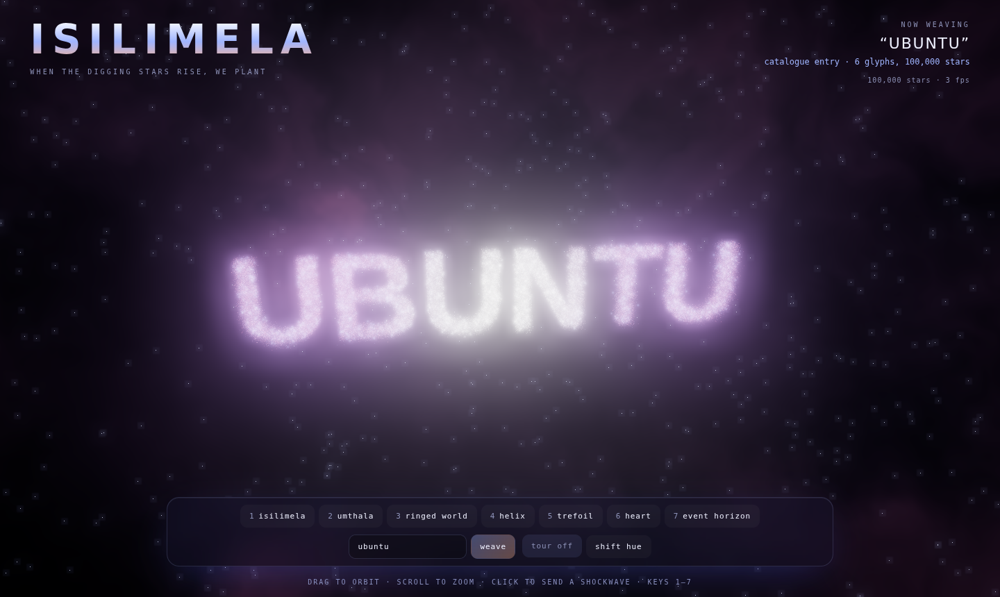

# Isilimela ✦

**Weave 100,000 stars into the Pleiades, the Milky Way, ringed worlds, knots, a heart, a black hole, or your own words.**

*Isilimela* is the isiXhosa and isiZulu name for the Pleiades, the "digging stars".
When they rise in the east before dawn in winter, it is time to start hoeing the fields
for the planting season. Among amaXhosa the star cluster was also used to count the years
since a man's initiation. This project borrows the name for a small loom of starlight:
every form is woven from the same 100,000 particles, and they fly between shapes on arcs
through space.



| | |
|---|---|
|  |  |
|  |  |
|  |  |

## The forms

| Key | Form | What it is |
|---|---|---|
| 1 | **Isilimela** | M45, the Pleiades: the bright sisters with diffraction spikes, wrapped in blue reflection nebulosity |
| 2 | **Umthala** | isiZulu for the Milky Way: a four-armed spiral with differential rotation (inner stars orbit faster) |
| 3 | Ringed World | A Saturn analogue with banded latitudes and a Cassini division in its rings |
| 4 | Double Helix | B-DNA with 10.5 base pairs per turn and a major/minor groove |
| 5 | Trefoil | The (2, 3) torus knot |
| 6 | Heart | Taubin's heart surface, (x²+9⁄4y²+z²−1)³ = x²z³ + 9⁄80y²z³ |
| 7 | Event Horizon | A black hole: accretion disk, lensed photon ring and relativistic jets |
| ✎ | Your word | Type anything in *write in the stars* and it is woven from the same particles |

## Interactions

- **Drag** to orbit and **scroll** to zoom
- **Move the mouse** through the stars to part them
- **Click** anywhere to send a shockwave through the field (or press **Space**)
- **1–7** jump straight to a form
- **Tour** cycles through the forms on its own; **shift hue** rotates the palette

## How it works

- **Three.js** with a custom `ShaderMaterial`. Every particle carries a `from` and `to`
  position; the GPU interpolates between them with a per-star stagger, so the swarm
  peels off and lands in waves instead of moving as one block.
- The mouse repulsion, the shockwave ring, the twinkle and the differential rotation of
  the galaxy and the accretion disk are all computed in the vertex shader.
- When you switch mid-flight, the CPU bakes each star's current position so the next
  morph starts seamlessly.
- Words are rasterised to an off-screen canvas and the stars sample the lit pixels.
- An `UnrealBloomPass` gives the glow, and the backdrop is a domain-warped fBm nebula
  painted on the inside of a sphere.

No build step and no dependencies to install: it is plain HTML, CSS and an ES module,
with three.js loaded from jsDelivr through an import map.

## Run it locally

```bash
git clone https://github.com/<you>/isilimela.git
cd isilimela
python3 -m http.server 8000   # or: npx serve .
```

Then open <http://localhost:8000>. It needs a local server because browsers block
ES modules loaded from `file://`.

## Deploy

Every push to `main` publishes the site with GitHub Pages through
`.github/workflows/pages.yml`. If the first run fails, open
**Settings → Pages** and set **Source** to **GitHub Actions**, then re-run the workflow.

## License

MIT
